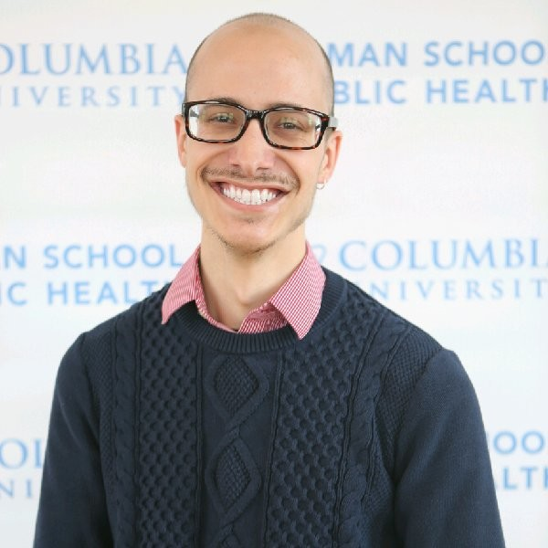

### About the Team

The team consists of four MPH students, experienced in infectious disease epidemiology and biostatistics. Collectively, the team has worked in a variety of capacities at the NYC Department of Health, the Florida Department of Health, EcoHealth Alliance, and ICAP at Columbia University. Please feel free to reach out and connect with us. 

#Tom#

[LinkedIn Profile](https://linkedin.com/in/tomcarpino/).

#Matt#

[LinkedIn Profile](https://www.linkedin.com/in/matthew-perrotta-41275654/). 

#Zach#

[LinkedIn Profile](https://www.linkedin.com/in/georgekeefer/). 

#Elliot#

[LinkedIn Profile](https://www.linkedin.com/in/elliot-rozen-8168118a/). 

