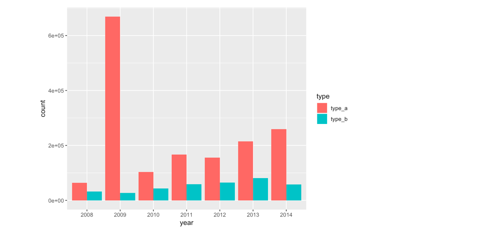
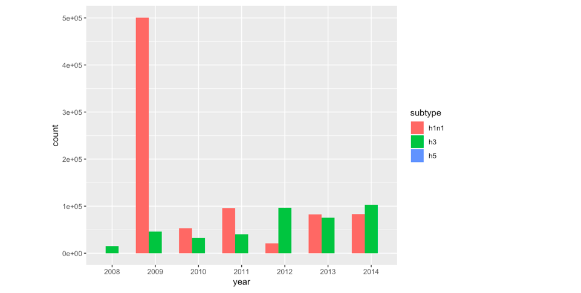
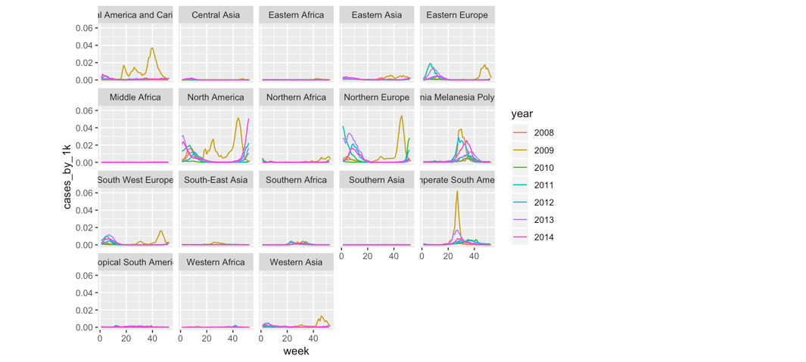
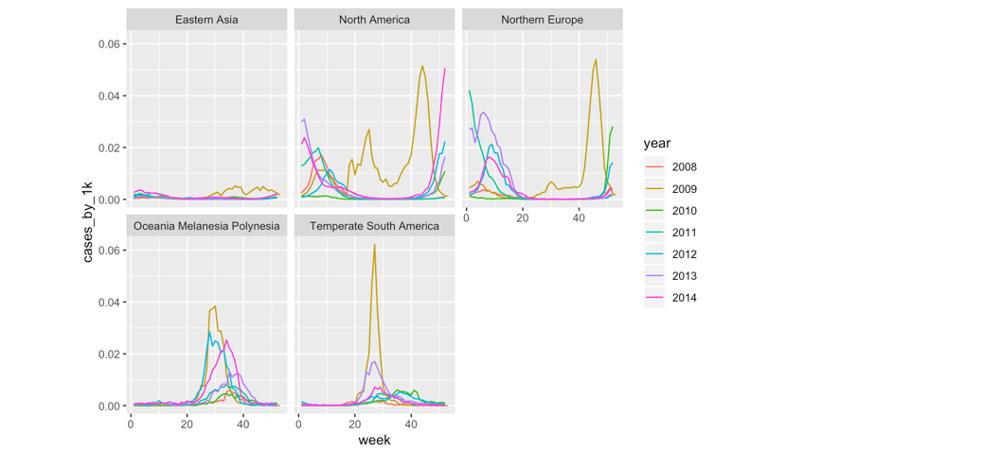
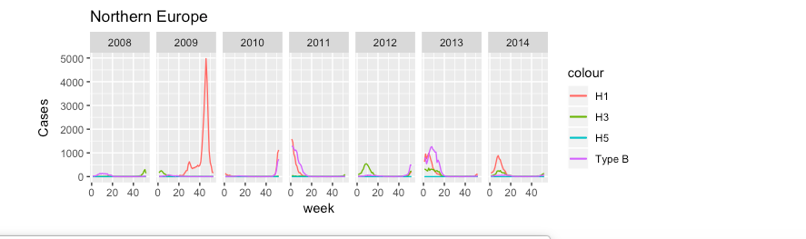
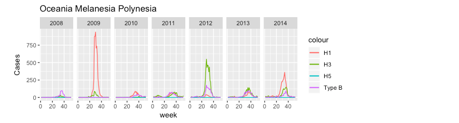
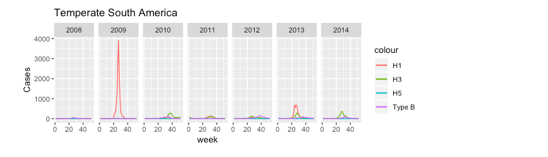
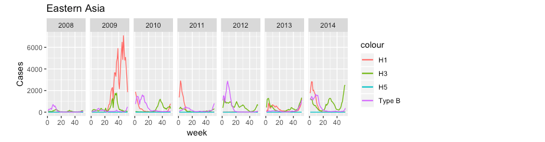
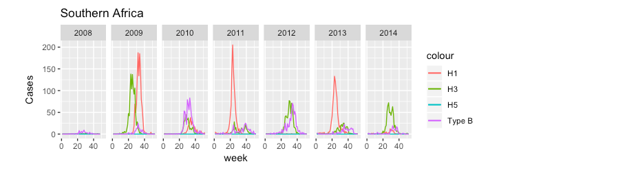

###Incidence by Strain###

We looked at incidence by subtype (Influenza A vs. Influenza B)

And by Influenza strain

####Cases by Region and Year####

The zones with the most complete data are North America, Northern Europe, Oceania Melanesia Polynesia, and Temperate South America

###Incidence by Strain###

We also looked at how incidence in these regions varied by Influenza Strain.

