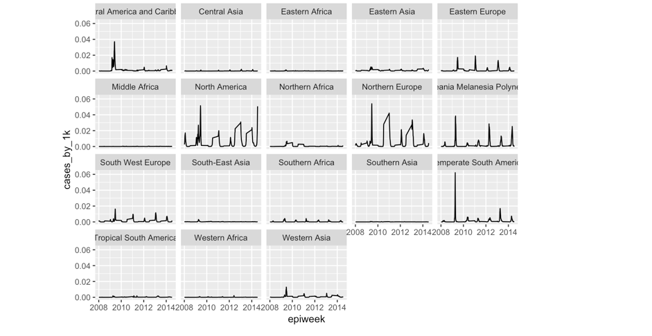
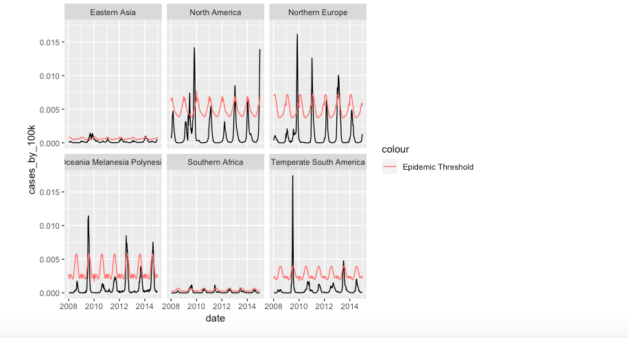

###Cases by Region###

####Cases by Region and Year####

The zones with the most complete data are North America, Northern Europe, Oceania Melanesia Polynesia, and Temperate South America

We also looked at incidence by subtype (Influenza A vs. Influenza B)

And by Influenza strain

Lastly, we tested to see if the Incidence crossed an Epidemic Threshold utilizing Serfling Regression

